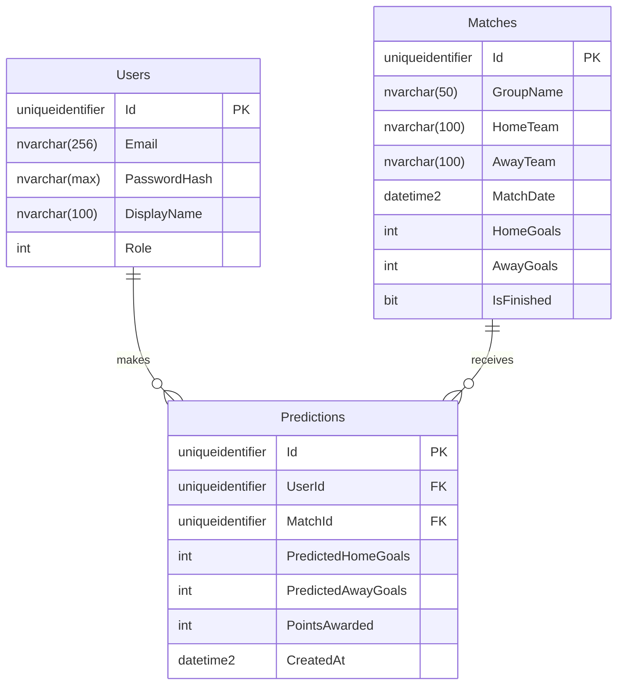

# Relational Schema

## Tables

### Users
| Column        | Type           | Constraints                    |
|---------------|----------------|--------------------------------|
| Id            | uniqueidentifier | PK, not null                 |
| Email         | nvarchar(256)  | not null, unique index         |
| PasswordHash  | nvarchar(max)  | not null                       |
| DisplayName   | nvarchar(100)  | not null                       |
| Role          | int            | not null (0 = User, 1 = Admin) |

### Matches
| Column        | Type           | Constraints       |
|---------------|----------------|-------------------|
| Id            | uniqueidentifier | PK, not null    |
| GroupName     | nvarchar(50)   | not null          |
| HomeTeam      | nvarchar(100)  | not null          |
| AwayTeam      | nvarchar(100)  | not null          |
| MatchDate     | datetime2      | not null (UTC)    |
| HomeGoals     | int            | null              |
| AwayGoals     | int            | null              |
| IsFinished    | bit            | not null          |

### Predictions
| Column               | Type             | Constraints                                   |
|----------------------|------------------|-----------------------------------------------|
| Id                   | uniqueidentifier | PK, not null                                  |
| UserId               | uniqueidentifier | FK → Users.Id, ON DELETE RESTRICT, not null   |
| MatchId              | uniqueidentifier | FK → Matches.Id, ON DELETE RESTRICT, not null |
| PredictedHomeGoals   | int              | not null                                      |
| PredictedAwayGoals   | int              | not null                                      |
| PointsAwarded        | int              | null (set after match result)                 |
| CreatedAt            | datetime2        | not null (UTC)                                |

**Unique constraint:** `(UserId, MatchId)` — one prediction per user per match.

---

## ER Diagram

